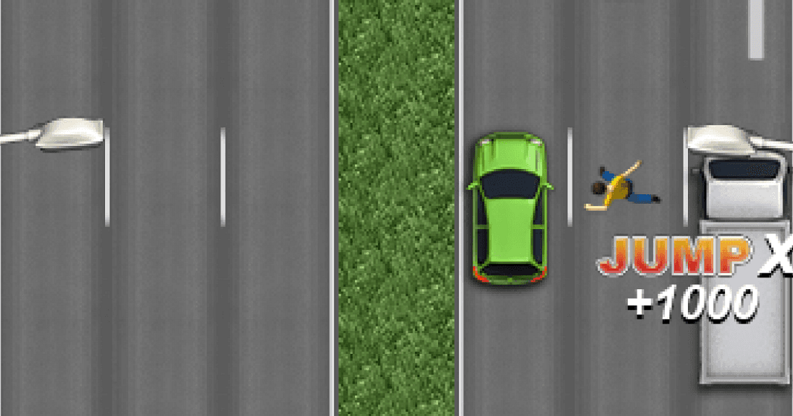

# Road Rush: un juego basado en Freeway Fury en PICO-8

**Road Rush** (un demake de Freeway Fury) © 2024 by Gaston Aguilera and Leonardo Coronel 2024 is licensed under Creative Commons Attribution-NonCommercial 4.0 International

## Introducción

*Road Rush* es un juego de acción arcade donde los jugadores controlan a un intrépido conductor que tiene una habilidad única: saltar de un auto en movimiento a otro para avanzar lo más rápido posible en una autopista congestionada. El objetivo principal es llegar lo más lejos posible dentro de un límite de tiempo, utilizando los vehículos como herramientas para escapar del tráfico y ganar tiempo adicional. El jugador debe medir riesgos, calcular saltos y controlar vehículos mientras maniobra entre carriles para evitar colisiones.

El juego está diseñado para ser rápido, emocionante y ofrecer un desafío creciente a medida que la velocidad del tráfico aumenta y los espacios entre autos se reducen.

## Mecánicas

- **Saltar de un vehículo a otro**: Esta es la mecánica central del juego. El jugador puede saltar de su auto actual a otro vehículo cercano, con el objetivo de evitar choques y avanzar más rápido. Los saltos se realizan cuando los vehículos están lo suficientemente cerca; de lo contrario, el jugador puede caer entre los autos y perder una vida. La distancia entre los vehículos y la velocidad relativa afecta la dificultad del salto.
- **Control de vehículos**: Una vez que el jugador toma control de un vehículo, puede manejarlo por un tiempo limitado. Cada auto tiene diferentes características de manejo (velocidad, aceleración y maniobrabilidad), lo que afecta la jugabilidad. Algunos autos son más rápidos pero difíciles de manejar, mientras que otros son más lentos pero más seguros para planear el próximo salto.
- **Tiempo limitado**: El jugador tiene un tiempo máximo para recorrer una cierta distancia. Al comenzar, el temporizador comienza a correr, y cada segundo cuenta. Sin embargo, cada salto exitoso otorga una pequeña cantidad de tiempo adicional, lo que incentiva a los jugadores a seguir saltando de auto en auto.
- **Tipos de vehículos**: 
  - **Autos Rápidos**: Son difíciles de controlar, pero permiten avanzar grandes distancias rápidamente. Saltar a estos autos otorga más tiempo adicional.
  - **Camiones**: Son más estables y fáciles para realizar saltos, pero su velocidad es limitada, lo que puede ralentizar el progreso del jugador.
  - **Motos**: Son vehículos ágiles, pero frágiles. Un choque en una moto resulta en una pérdida instantánea.
  - **Autos Explosivos**: A veces, el jugador puede saltar a un auto a punto de explotar. Estos vehículos tienen un temporizador de autodestrucción, por lo que el jugador debe saltar rápidamente para evitar perder una vida.
- **Puntos de Control**: A lo largo de la carretera hay ciertos puntos de control que marcan hitos en el progreso del jugador. Al pasar por un punto de control, el temporizador se restablece ligeramente y se guarda el avance. Si el jugador pierde una vida, puede reiniciar desde el último punto de control alcanzado.


## Material de referencia




## Pautas de Diseño

- **Estilo gráfico retro**: El juego aprovecha las limitaciones gráficas de Pico-8 para crear un estilo retro y arcade. Los autos y personajes están representados con píxeles simples pero reconocibles, y los colores vibrantes se usan para diferenciar los tipos de vehículos. El horizonte se desplaza rápidamente para dar una sensación de velocidad constante.
- **Interfaz minimalista**: La interfaz de usuario será minimalista, mostrando solo el cronómetro, la distancia recorrida y el puntaje actual. Esto ayuda a mantener la pantalla despejada para que el jugador pueda concentrarse en la acción.
- **Jugabilidad fluida**: Se busca una experiencia rápida y adictiva, con transiciones suaves entre velocidades.
- **Sonido 8-bit**: La música y los efectos de sonido tendrán un estilo retro, complementando el look de la PICO-8.

## Alcance

Tener funcional una pantalla dónde un jugador podra manejar un vehiculo e ir cambiando entre los que se le presentan en la ruta. Los vehiculos apareceran de forma aleatoria a medida que avanza el jugador. Al inicio del partido se ubica en el medio de una calle sin vehiculos mas que el del jugador.  

## Hitos

 - [x] Armado de repositorio / proyecto.
 - [x] Generar documento de diseño.
 - [ ] Manejar un vehiculo
 - [ ] Saltar de un vehiculo a otro
 - [ ] Contar los kilometros recorridos
 - [ ] Sonido de choques o explosiones
 - [ ] Animaciones de conductores saliendo de vehiculos 

## Ejemplo de código

```lua
function _init()
    printh "Hola desde Road Rush"
end

function _update()
end

function _draw()
end